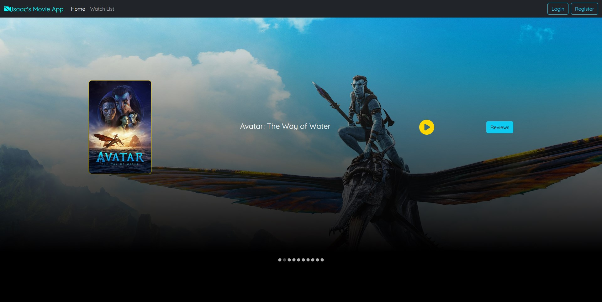
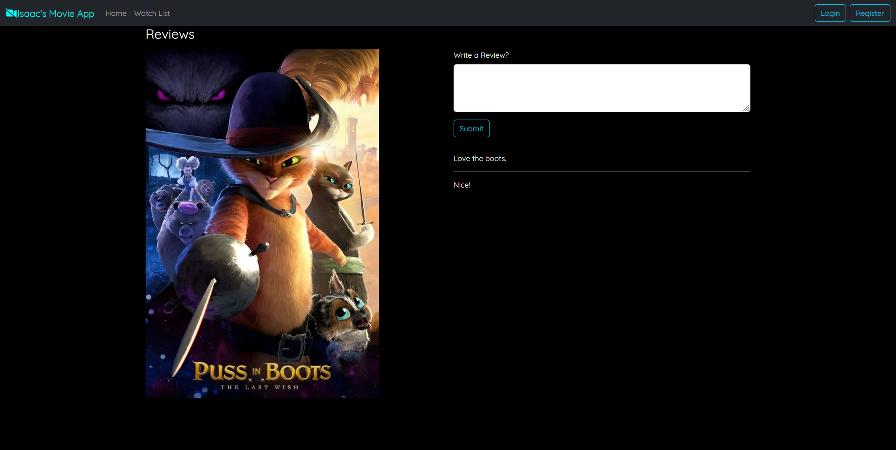

# IMDB Clone Full Stack Implementation: Front end

This codebase contains the React code to display the movie application in the browser.

It utilizes Axios to make calls to the Spring Boot REST API and CSS/Bootstrap to assist in formatting.

# To run
Ensure React is installed correctly by typing `npm install` at the root of this project.

Then simply enter the command: `npm start`.

You will need to make sure the backend is running simultaneously for full functionality.

For information on running the backend of this application, visit this link: https://github.com/IsaacMFernandes/movie_application_backend